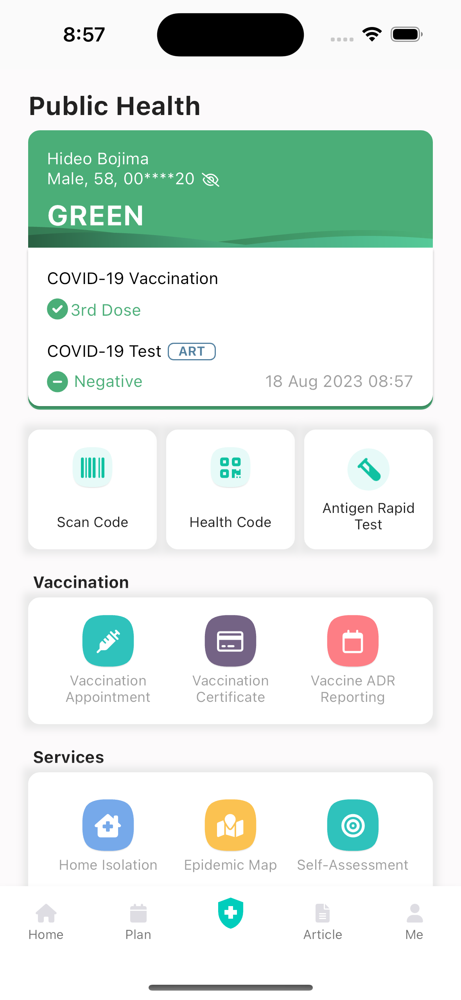
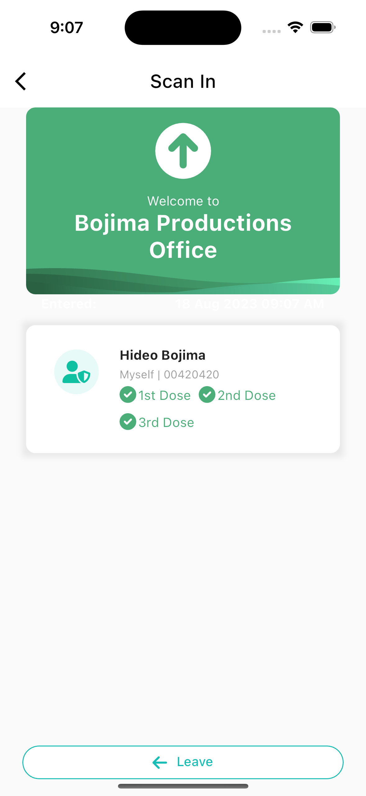
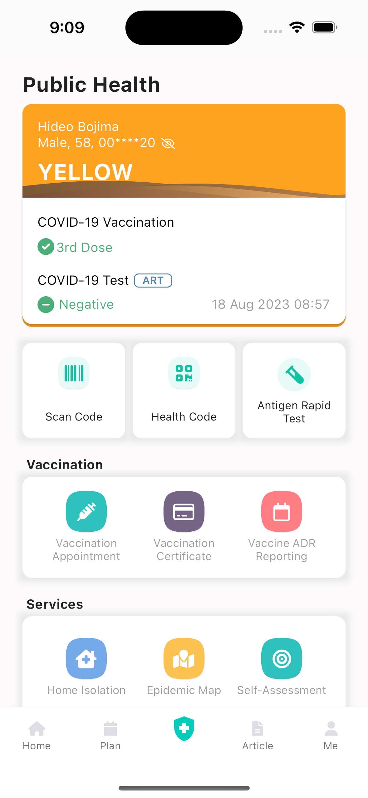
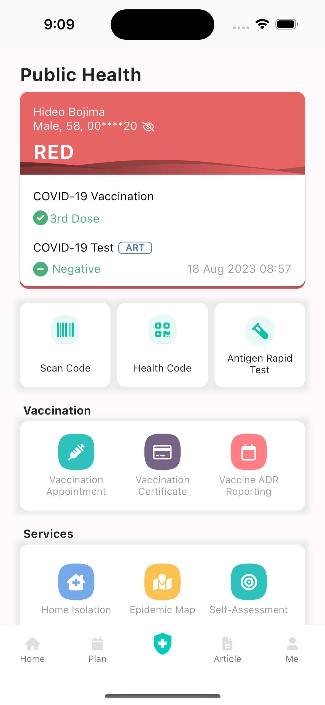

# BruHealthy App

My attempt to replicate the UI design of the BruHealth app by EVYD. Built with Flutter 💙

## Features

there is a secret button to:

- change card colors
- add more vaccine shots

## Showcase

https://github.com/danialothman/bruhealthy/assets/10879981/8704b2be-7131-4c0e-9a07-c82a2ca2dd52

## Screenshots

<table>
<tr>
<td></td>
<td></td></tr>
<tr>
<td></td>
<td></td></tr>
</table>
